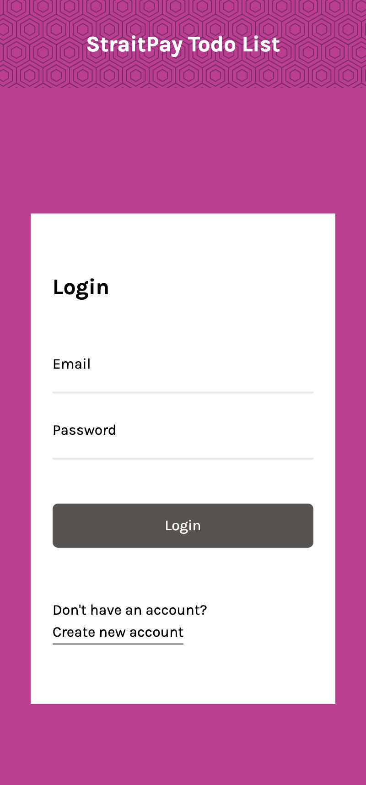
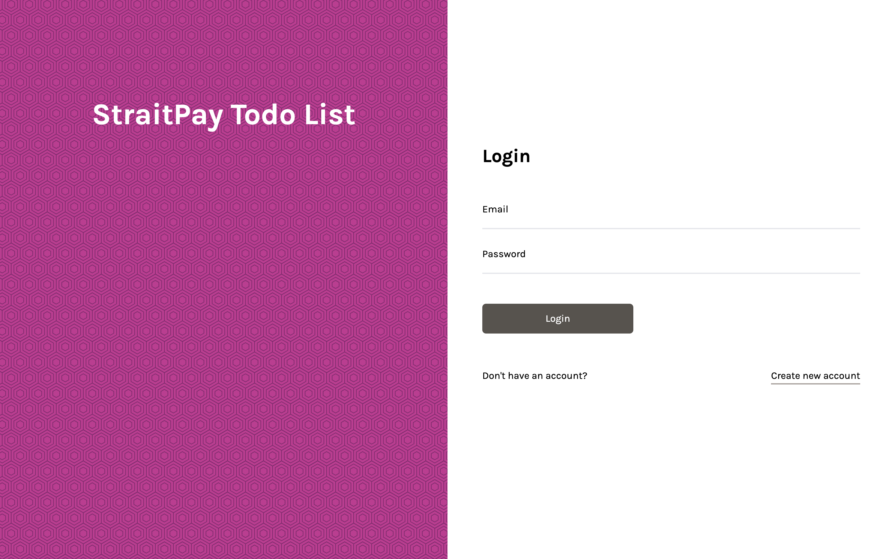
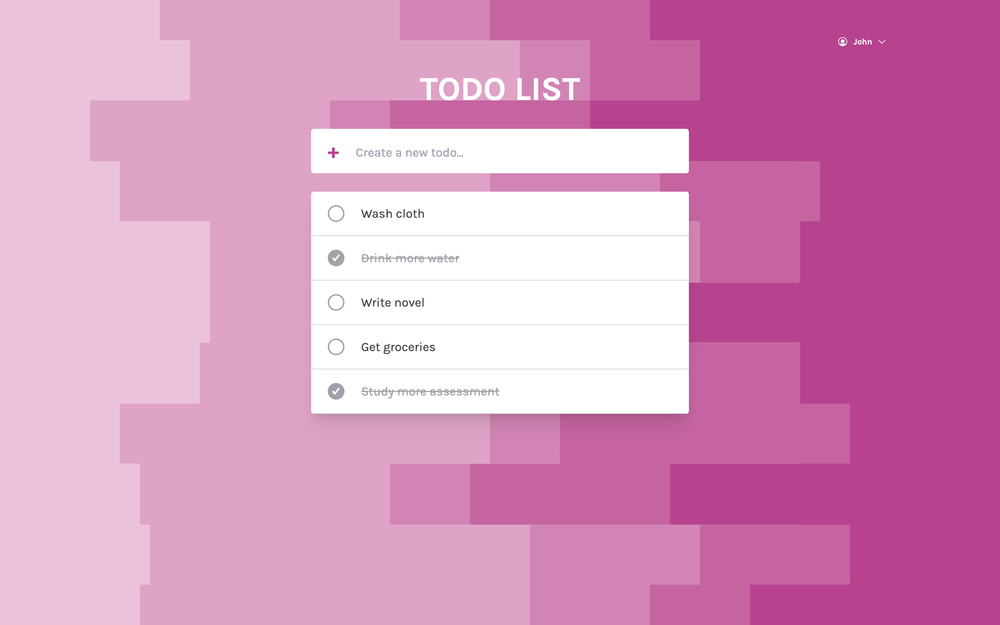

# StraitPay Todo List Assessment

This is a solution to the StraitPay assessment. 

## Table of contents

- [Overview](#overview)
  - [The challenge](#the-challenge)
  - [Screenshot](#screenshot)
      - [Mobile](#mobile)
      - [Desktop](#desktop)
  - [Links](#links)
  - [Built with](#built-with)
- [Author](#author)

## Overview

### The challenge

Users should be able to:

- View the optimal layout for the app depending on their device's screen size
- See hover states for all interactive elements on the page
- Add new todos to the list
- Mark todos as complete
- Update old todos
- Delete todos from the list
- View error if right criteria is not met

### Screenshot

#### Mobile

  
  
  
 

#### Desktop

  
  
  
 

### Links

- Live  URL: [StraitPay Todo Assessment](https://straitpay-todo-assessment.surge.sh/)

### Built with

- Node.js
- Express.js
- MongoDB
- React
- [Tailwindcss](https://tailwindcss.com/) - CSS framework
- Axios
- TypeScript
- Redux Toolkit

## Author

- Github - [Hikmah Yousuph](https://github.com/Hikmahx)
- Email - [hikmayousuph@gmail.com](hikmayousuph@gmail.com)
- LinkedIn - [Hikmah Yousuph](linkedin.com/in/hikmah-yousuph-449467204/)
